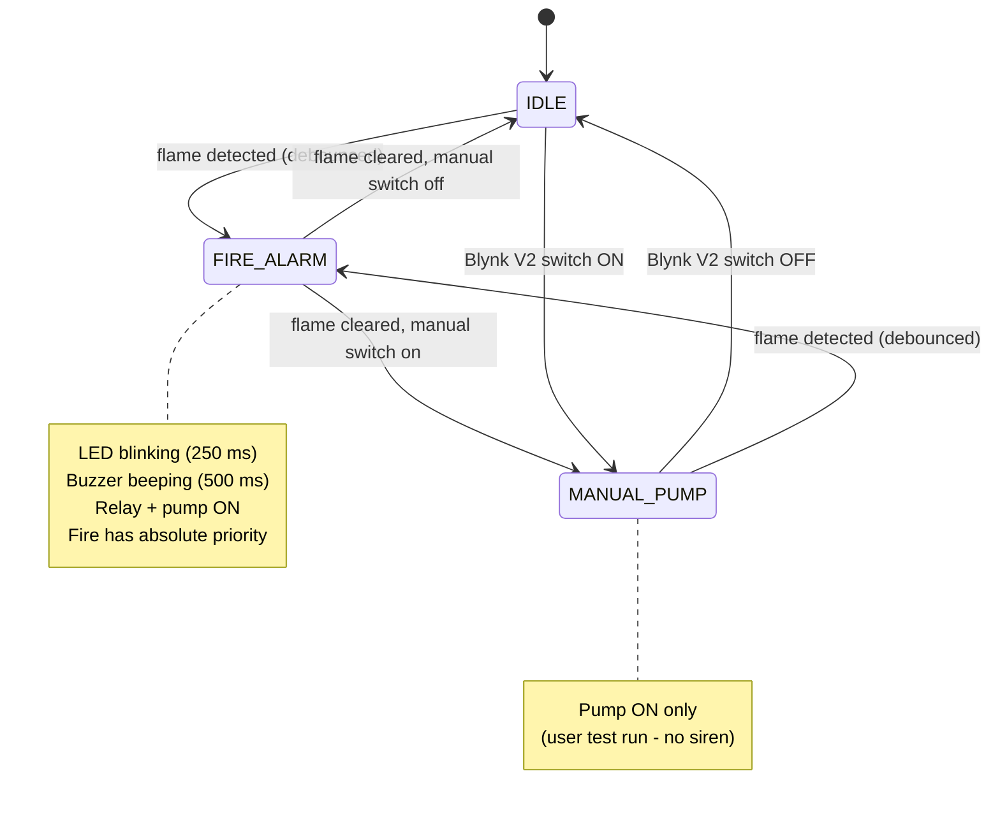

# Architecture

## System Workflow

Every pass of `loop()` executes the same four-stage pipeline. No stage ever blocks (no `delay()`), so the loop runs thousands of times per second and every module stays responsive.

```
        ┌──────────────────────────────────────────────────────┐
        │                     loop()                           │
        │                                                      │
        │  1. SENSE    flameSensorUpdate(now)                  │
        │              └─ poll GPIO27 every 50 ms, debounce    │
        │                                                      │
        │  2. DECIDE   updateStateMachine()                    │
        │              └─ fire? manual request? → next state   │
        │                                                      │
        │  3. ACT      applyOutputs(now)                       │
        │              └─ LED / buzzer / relay match the state │
        │                                                      │
        │  4. REPORT   blynkUpdate(fire, pump, now)            │
        │              └─ telemetry every 1 s, read V2 switch  │
        └──────────────────────────────────────────────────────┘
```

`setup()` runs once, in safety-first order: local hardware (sensor, LED, buzzer, relay) is initialized **before** any network code, and the network is allowed to fail — the detection core never depends on the cloud.

## State Machine



| State | Alarm LED | Buzzer | Relay / Pump |
|---|---|---|---|
| `IDLE` | off | off | off |
| `FIRE_ALARM` | blinking | beeping | **on** |
| `MANUAL_PUMP` | off | off | **on** |

The transition logic lives in one function, `computeNextState()` in `main.cpp`, and the order of its checks encodes the safety priority: **fire beats everything**. The Blynk manual switch can start the pump, but it can never silence an active alarm.

## Module Responsibilities

| Module | Owns | Public API | Knows about |
|---|---|---|---|
| `flame_sensor` | GPIO27, debounce state | `flameSensorSetup/Update/FireDetected` | config, constants |
| `led_controller` | GPIO26, blink timing | `ledSetup/Blink/Off` | config, constants |
| `buzzer_controller` | GPIO25, beep timing | `buzzerSetup/Beep/Off` | config, constants |
| `relay_controller` | GPIO33, pump state | `relaySetup/SetPump/IsPumpOn` | config, constants |
| `wifi_manager` | Wi-Fi radio | `wifiConnect/IsConnected/PrintStatus` | config, constants |
| `blynk_manager` | Blynk cloud link, V2 switch state | `blynkSetup/Update/ManualPumpRequested` | wifi_manager, config, constants |
| `main` | state machine, orchestration | `setup()`, `loop()` | every module's *header* only |

Design rules the modules follow:

- **One owner per pin.** No two modules touch the same GPIO. `main.cpp` never calls `digitalWrite`.
- **Tiny APIs.** Each module exports 2–3 functions. Internal state is `static` (file-private) — the C-style equivalent of `private:`.
- **Dependencies point downward.** Modules depend on `config.h`/`constants.h`; only `main` depends on modules; only `blynk_manager` depends on `wifi_manager`. There are no cycles.
- **Time is passed in.** Modules receive `now` from the loop instead of calling `millis()` in scattered places — one consistent clock per pass, and the pattern makes future unit testing (injecting fake time) possible.

## Why plain functions instead of C++ classes?

The MVP has exactly one flame sensor, one relay, one buzzer, one LED. Classes earn their complexity when you need multiple instances or polymorphism; here they would add ceremony without benefit ("keep it as simple as possible, avoid unnecessary abstractions"). The module boundaries are already class-shaped — if v2 needs two pumps, converting `relay_controller` into a class is a mechanical refactor.

## Simulation ↔ real hardware mapping

| Real component | Wokwi stand-in | Why it's equivalent |
|---|---|---|
| Flame sensor DO (active-LOW) | Slide switch to GND | Both just pull GPIO27 LOW on "fire" |
| Water pump + supply | Green LED + resistor | Both are a load switched by the relay's COM/NO contacts |
| Relay module | `wokwi-relay-module` | Identical (clicks and switches contacts) |
| Wi-Fi router | `Wokwi-GUEST` virtual AP | Real internet access from the simulator |

Because only the *stand-ins* differ and never the firmware, migration = editing `include/config.h`.
